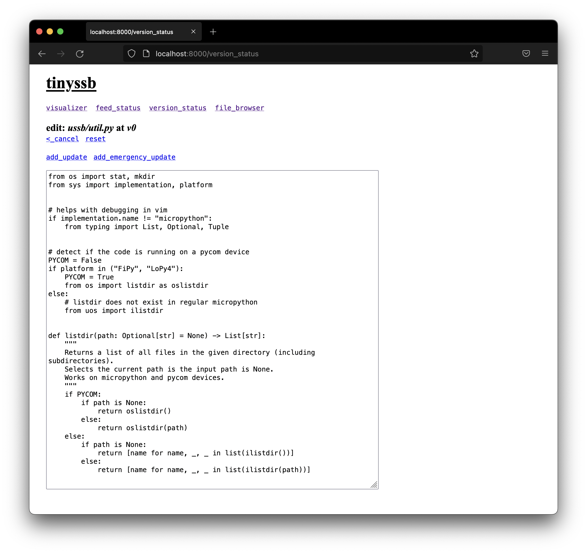

# Distributing updates via append-only logs
Implementation of the [tinyssb](https://github.com/tschudin/tinyssb) protocol
with a web GUI and version control system. The code is written in micropython
and cannot be run using regular Python. Also works on Pycom devices that support
LoRa and wifi connectivity.

## UNIX Setup
1. Copy the contents of the `ussb` directory into a new node directory.
2. Create a new master node (allowed to create updates) with the command
`micropython main.py e` (export). This creates the initial feeds and exports
the trust anchor into the directory `ROOT_EXPORT`.
3. Create new nodes by adding the contents of the `ROOT_EXPORT` to their directories.
4. A node can be run by executing one of the following commands:  
`micropython main.py r`  
`micropython main.py w` (with http server and web GUI)

A node can be reset by running `micropython main.py c`.

## PYCOM Setup
1. Follow the first three steps of the **UNIX Setup**.
2. Copy the contents of each node directory to a pycom device (must have LoRa and wifi).
3. The node is automatically started on power up. The http server is enabled by default
(192.168.4.1:80 when connected to wifi of pycom device).

## Screenshots

